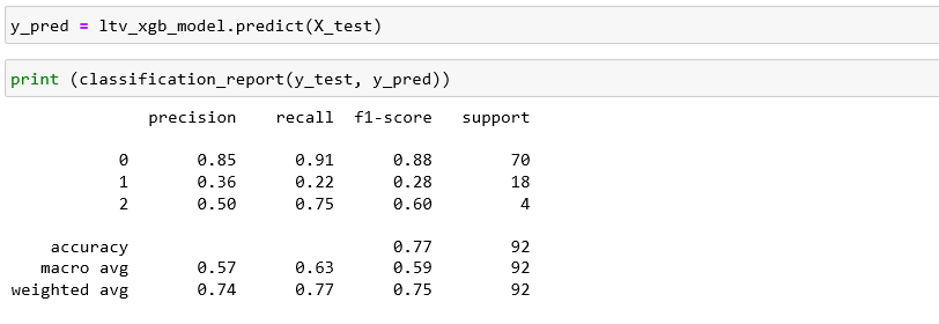

# CLTV_Prediction_Model_Python

Customer lifetime value is the metric that indicates the total revenue a business can reasonably expect from a single customer account. It considers a customer's revenue value, and compares that number to the company's predicted customer lifespan. Businesses use this metric to identify significant customer segments that are the most valuable to the company.
The longer a customer continues to purchase from a company, the greater their lifetime value becomes.
We invest in customers (acquisition costs, offline ads, promotions, discounts & etc.) to generate revenue and be profitable. Naturally, these actions make some customers super valuable in terms of lifetime value but there are always some customers who pull down the profitability. We need to identify these behavior patterns, segment customers and act accordingly.
### Customer Lifetime Value [CLTV] : Total Gross Revenue - Total Cost

## Lifetime Value Prediction
We will continue using our OnlineRetail Dataset for this example. Let’s identify our path to glory:
•	Define an appropriate time frame for Customer Lifetime Value calculation
•	Identify the features we are going to use to predict future and create them
•	Calculate lifetime value (LTV) for training the machine learning model
•	Build and run the machine learning model
•	Check if the model is useful
Deciding the time frame really depends on your industry, business model, strategy and more. For some industries, 1 year is a very long period while for the others it is very short. In our example, we will go ahead with 6 months.
RFM scores for each customer ID are the perfect candidates for feature set. To implement it correctly, we need to split our dataset. We will take 3 months of data, calculate RFM and use it for predicting next 6 months. So we need to create two dataframes first and append RFM scores to them.

 

Precision and recall are acceptable for 0. As an example, for cluster 0 (Low LTV), if model tells us this customer belongs to cluster 0, 85 out of 100 will be correct (Precision). And the model successfully identifies 91% of actual cluster 0 customers (Recall). We really need to improve the model for other clusters. For example, we barely detect 22% of Mid LTV customers. Possible actions to improve those points:
•	Adding more features and improve feature engineering
•	Try different models other than XGBoost
•	Apply hyper parameter tuning to current model
•	Add more data to the model if possible

Now we have a machine learning model which predicts the future CLTV segments. 

Thanx.

